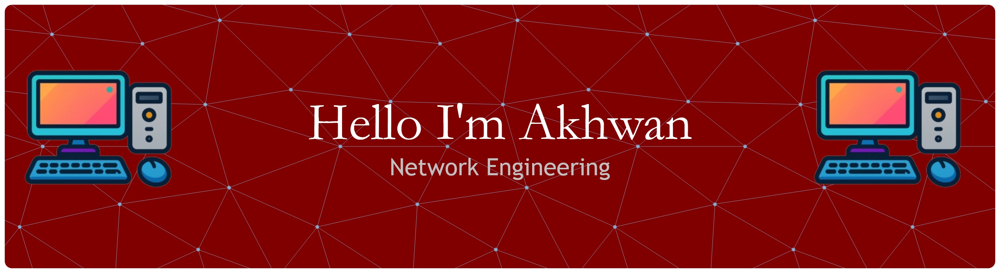

## Hi World, I'm Muhammad Akhwan Nursidiq

###

I am Muhammad Akhwan Nursidiq, an Electrical Engineering graduate with a Telecommunications background and a strong interest in Network Engineering.  My practical focus includes MikroTik RouterOS, TCP/IP networking, routing, DHCP, NAT, firewall configuration, bandwidth management, network topology design, and network monitoring.  I enjoy turning network concepts into practical, testable infrastructure through labs and hands-on projects.

###

<h2 data-importer="text" align="left">About me</h2>

###

🎓 Bachelor of Electrical Engineering Telecommunication in Universitas Jenderal Achmad Yani  🌐 Interested in Network Engineering & IT Infrastructure 🔧 Interested in MikroTik, Cisco, and Network Security 📡 Interested in Routing, Switching, VLAN, and TCP/IP 📚 Continuously learning and building practical projects

###

<h2 data-importer="text" align="left">Learn More</h2>

###

  
  
  

###

<picture data-importer="pacman">
  <source media="(prefers-color-scheme: dark)" srcset="https://raw.githubusercontent.com/akhwannursidiq/akhwannursidiq/pacman-output/pacman-contribution-graph-dark.svg?game=pacman">
  <source media="(prefers-color-scheme: light)" srcset="https://raw.githubusercontent.com/akhwannursidiq/akhwannursidiq/pacman-output/pacman-contribution-graph.svg?game=pacman">
  
</picture>

###

